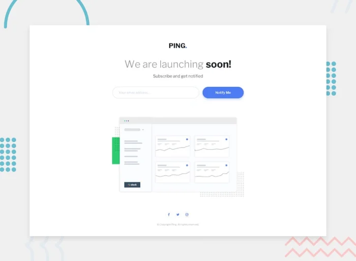

# Frontend Mentor - Coming Soon Page

This is a solution to the Coming Soon Page Challenge on Frontend Mentor.

## Table of Contents

- [Frontend Mentor - Coming Soon Page](#frontend-mentor---coming-soon-page)
	- [Table of Contents](#table-of-contents)
	- [Overview](#overview)
		- [Screenshot](#screenshot)
		- [Links](#links)
		- [Built With](#built-with)
		- [Key Features](#key-features)
	- [How to Use](#how-to-use)
	- [Contributing](#contributing)
	- [License](#license)
	- [Author](#author)

## Overview

This project is a solution for the Coming Soon Page, a challenge on Frontend Mentor. The goal of this challenge is to build out a coming soon page and get it looking as close to the design as possible.

### Screenshot



### Links

- [Solution URL](https://www.frontendmentor.io/solutions/coming-soon-page-html-css-js-IQytZFYOeP)
- [Live Site URL](https://dz-coming-soon-page.netlify.app/)

### Built With

- Semantic HTML5 markup
- Modern CSS techniques
- JavaScript

### Key Features

- Responsive Design: Adjusts seamlessly to different screen sizes (mobile, tablet, desktop).
- Feature Summary: This coming soon page includes a subscription form, and social media links to keep users engaged and informed about the upcoming launch.
- Modern UI: Clean and modern user interface.

## How to Use

1. **Clone the repository**:

   First, clone this repository to your local machine. Open your terminal and run the following command:

   ```bash
   git clone https://github.com/hichamweblog/FEM-Coming-Soon-Page.git
   ```

2. **Navigate to the Project Folder**:

   Change your working directory to the newly cloned project folder:

   ```bash
   cd FEM-Coming-Soon-Page
   ```

3. **Install Dependencies**:

   Install the required packages by running:

   ```bash
   pnpm install
   ```

4. **Run the project**:

   ```bash
   pnpm run dev
   ```

   This command will launch a development server, and you'll be able to view the website locally in your web browser.

## Contributing

If you would like to contribute to this repository, feel free to open issues or submit pull requests. Contributions and improvements are always welcome.

## License

This project is licensed under the [MIT License](./LICENSE).

## Author

- Frontend Mentor - [@hichamweblog](https://www.frontendmentor.io/profile/hichamweblog)
- LinkedIn - [@hichamweblog](https://linkedin.com/in/hichamweblog)
- X - [@hichamweblog](https://x.com/hichamweblog)
